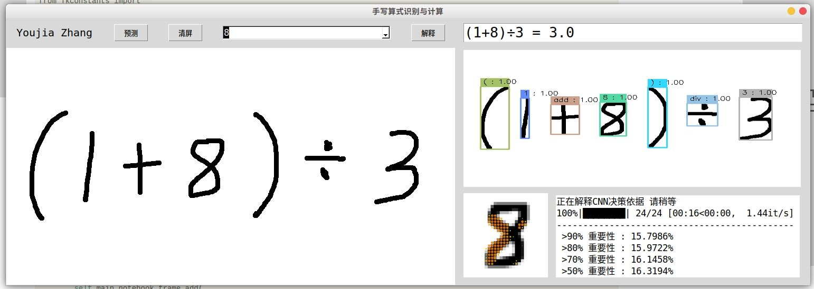
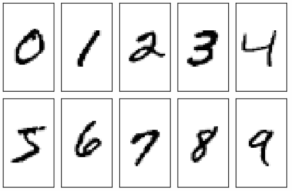
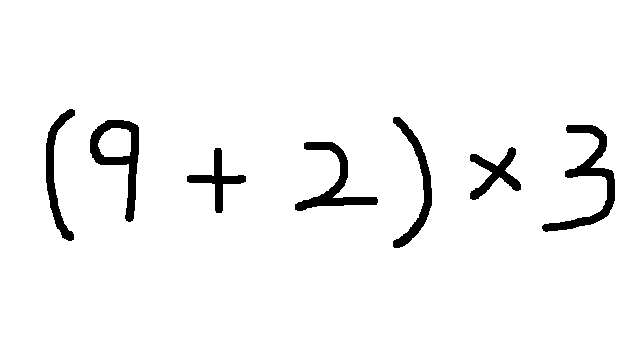
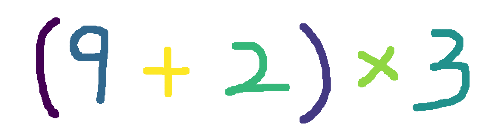
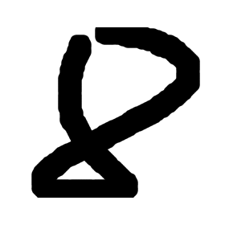
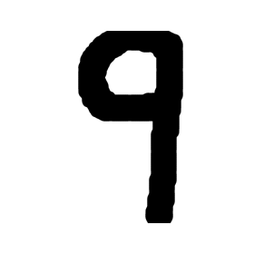
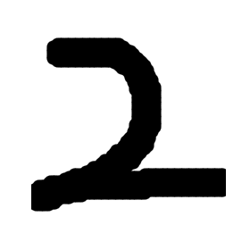
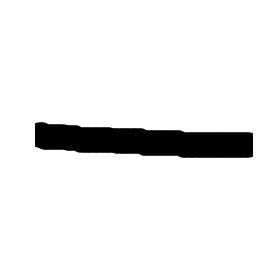
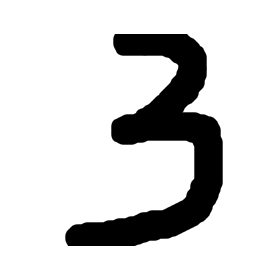
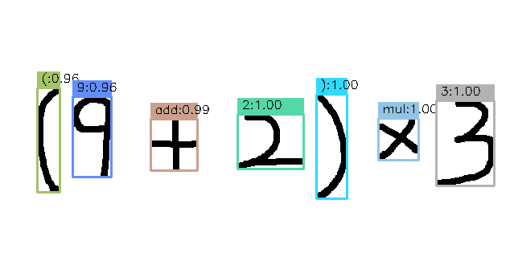

# MNIST · Handwriting Recognition Calculator
<div align=center>

</div>

Main code in [main.ipynb](../main.ipynb), using python==3.6.9, Ubuntu 18.04.6 LTS [Chinese README.md](../README.md)             
Dependent packages.
- matplotlib == 3.3.4
- tensorflow == 2.6.2
- scikit-learn == 0.24.2
- numpy == 1.19.5
- tqdm == 4.62.3
- opencv-python == 4.5.4.58

## 1. dataset extensions
The MNIST dataset contains only **0~9** 10-digit images.

<div align=center>

</div>

We also need to prepare datasets for the quadratic operators **+, -, ×, ÷** and **(, )**. The collected extended datasets are sorted, and each folder holds all the data for a symbol. The extended dataset is located in `models/cfs.tar.xz` and can be used after unpacking, and contains 33895 images in 6 folders.

## 2. Model training
A CNN is used for prediction, and the model structure is shown as follows.
```
Model: "sequential_1"
_________________________________________________________________
Layer (type) Output Shape Param ##   
=================================================================
conv2d (Conv2D) (None, 26, 26, 28) 280       
_________________________________________________________________
conv2d_1 (Conv2D) (None, 24, 24, 28) 7084      
_________________________________________________________________
conv2d_2 (Conv2D) (None, 22, 22, 28) 7084      
_________________________________________________________________
max_pooling2d (MaxPooling2D) (None, 11, 11, 28) 0         
_________________________________________________________________
flatten (Flatten) (None, 3388) 0         
_________________________________________________________________
dense (Dense) (None, 256) 867584    
_________________________________________________________________
dense_1 (Dense) (None, 16) 4112      
=================================================================
Total params: 886,144
Trainable params: 886,144
Non-trainable params: 0
_________________________________________________________________ 
```

## 3. Target detection
We wrote an equation as follows.

<div align=center>

</div>

For the image above, we need to effectively identify each symbol. K-MEANS is a popular clustering algorithm that is simple, fast and easy to implement. But this algorithm is not suitable for our scenario, **because K-MEANS needs to determine in advance how many classes to divide**, this is not very good implementation and judgment. (But it is not impossible)

To solve this problem we can use the **DBSCAN** (Density-Based Spatial Clustering of Applications with Noise) algorithm, which is a well-known density-based clustering algorithm. Because our handwritten characters, the local
part of the strokes are dense; and the characters are relatively sparse from character to character, so this algorithm can be used.

<div align=center>

</div>

The sorting still works well. Then we need to extract each recognized symbol and process it into a 28*28 size image for easy input to our model. The result of the split image is as follows.

|(|9|+|2|)|×|3|
|-|-|-|-|-|-|-|
||||||||||

We input each segmented image into the model for prediction, and we label the predicted symbol class, the predicted probability, and the position of the symbol in the original image, resulting in
<div align=center>

</div>

## 4. Expression calculation

We generally evaluate by **postfixing expressions (inverse Polish expressions)** because it is much simpler to evaluate a postfix expression than to evaluate a midfix expression directly. The **middlefix expression** not only relies on operator precedence, but also has to deal with parentheses, while the operator precedence is already taken into account in the suffix expression and there are no parentheses. There are two main steps.
1. converting a midfix expression to a suffix expression
2. evaluating the suffix expression

### 4.1 Medial to Suffix
Using a **Stack** (which holds the operator) and an **Output**, read in the middling expression from left to right.
- If the character is an operand, add it to Output.
- If the character is an operator, pop the operator from the stack into Output until you encounter a left bracket or an operator with lower priority (and do not pop it). This operator is then pushed onto the stack.
- If the character is a left bracket, it goes on the stack for no reason.
- If the character is a right bracket, the operator is popped off the stack into Output until a left bracket is encountered. (The left bracket is only popped, not put into the output string)
- After the midfix expression is read, if the stack is not empty, pop all operators from the stack and add them to Output.

### 4.2 Computing suffix expressions
Using a stack, read in the suffix expression from left to right.
- If the character is an operand, press it onto the stack.
- If the character is an operand, pop two operands from the stack, perform the corresponding operation, and press the result onto the stack. (If two operands cannot be popped in succession, the expression is incorrect)
- When the expression is scanned, the stack holds the final computation result.

## 5. CNN explainability
Although deep learning models have good prediction results, their internal prediction principles are often difficult to explain and are often seen as black box models. We use a masking approach to quantify the decision basis of the model. The basic idea is that if changing the value of an input feature increases the error of the model output, the feature is considered important because the model relies on it to perform predictions. Conversely, if changing the value of the feature increases the error of the model output by a small amount (or by essentially the same amount as the original result), then the feature is not important and the model does not rely on it.

We choose the symbol **"9"** for the interpretive calculation, the results of which are shown below.

<div align=center>

</div>

The **predicted contribution (importance)** of each pixel is visualized on the original image, with a total of 28*28 contribution values. The larger the value, the larger the size of the **dots** and the heavier the color. 
